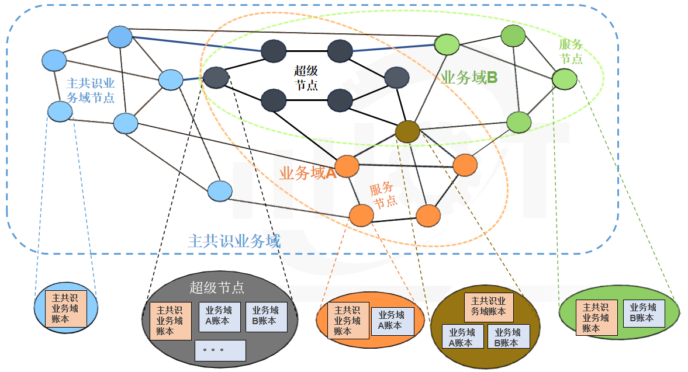
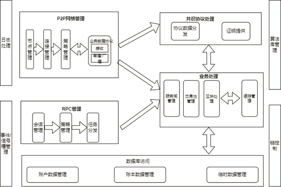
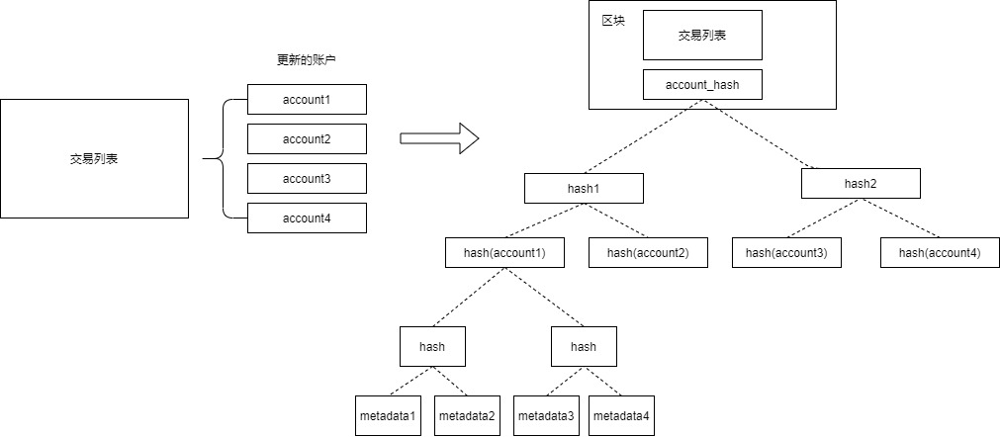

# 1.星火关键特性

- 许可公有：可治理的准入机制

- 数据分片：动态水平扩展的分片机制

- Metadata：数据与逻辑分离的合约结构，支持合约升级

- 并行交易：数据库键值级别的冲突解决机制实现交易最大化并行执行
- 分布式存储：支持海量存储

## 1.1 支持动态分片的网络拓扑

星火链设计采用多业务域+多账本架构处理不同业务领域数据在区块链上运行的业务场景。支持区块链节点加入多个业务域，业务域间交易处理、数据存储相互隔离，保障区块链系统隐私性的同时，降低了系统的运维复杂度。所有业务域数据由权威机构背书的超级节点统一进行共识，保障系统的安全性。

网络内部分为两类节点角色，共识节点、服务节点。

**主共识业务域和业务域**

网络内的基础分片称为主共识业务域，所有节点（共识节点，服务节点）默认都在主共识业务域内，主共识业务域是唯一的。

业务域是根据业务需求由网络内用户申请创建的分片。业务域的数量不受限制，主共识业务域内的普通节点可以按需加入或退出业务域。

主共识业务域和其他业务域共享一套共识引擎，保持区块高度一致，共识节点负责所有域的共识。

星火链网络拓扑架构如下图所示：

主要包含以下元素：

- **主共识业务域节点**：未加入业务域的非共识节点；节点加入星火链网网络时默认加入主共识业务域，节点内维护主共识业务域账本。星火链网网络中，所有节点均在此域内。

- **主共识业务域账本**：主共识业务域节点维护的账本，内部维护区块链网络中的一些配置信息。

- **共识节点**：因为需要全量的账本数据进行共识，所以默认加入所有服务域。

- **服务节点**：非共识节点，允许加入多个业务域。仅保存所在业务域的账本数据。

## 1.2 模块化、组件化的逻辑架构

节点逻辑架构从功能上看，可分为以上几个独立模块；模块之间相互独立，单一模块改造不影响其它模块。

- **P2P网络管理**：主要管理p2p网络相关内容，维护与其它对等节点的连接关系、数据维护策略，以及数据的收发工作。具体业务协议的处理由具体对应模块处理，p2P模块仅负责业务消息的转发。

- **共识协议处理**：区块链作为一种分布式系统的应用，节点间数据一致性需要通过共识协议保证。共识协议处理模块接收处理P2P网络管理及业务处理模块发送的共识消息。共识协议处理负责各个共识类型协议的处理，并提供共识相应证明数据；（如pbft的leader信息，共识签名数据等）。

- **RPC管理**：维护处理外部客户端请求数据，内部可根据请求信息进行权限管理、信息统计等策略处理。

- **业务处理**：区块链节点核心处理逻辑，管理维护服务域数据、交易池、区块打包/验证等逻辑。

- **数据库**：区块链账本、账户数据存储，并可保存一些不影响区块链状态的临时数据。

## 1.3 增量更新的账户状态

星火链是基于状态机模型设计的区块链系统，账户是最基本的状态单位，产生区块和共识的过程即是所有节点对账户状态变更达成一致的过程。在以太坊系统中所有的账户应用Merkle Tree算法计算出的根哈希被称为世界状态，每个账户内所有的数据构建的Merkle Tree的根哈希称为账户状态；世界状态和账户状态的是基于全量数据来计算的。与以太坊不同，星火链采用增量的方式来计算世界状态和账户状态。

增量的世界状态计算方式如下，使用一个区块内有修改的所有账户的账户状态构建一个完全独立的Merkle Tree，使用它的根哈希作为这个区块的世界状态。

账户状态同理，使用一个区块内，当前账户下所有被修改的数据构建Merkle Tree，使用其根哈希作为当前账户在某一区块高度时的账户状态。

增量计算状态的方式可以把计算状态的成本控制在O（1）,从而极大提高单合约账户内存储数据的上限。

## 1.4 特性列表

| 整体架构           |                                   |
| ------------------ | --------------------------------- |
| 架构模型           | 许可公有的主子链架构              |
| 分片架构           | 支持链内动态水平扩展的分片结构    |
| 分布式存储         | 支持海量数据存储                  |
| 并行计算           | 支持数据库级别的块内交易并行执行  |
| 节点类型           | 共识节点、服务节点                |
| 计算模型           | 排序-执行-验证                    |
| **系统性能**       |                                   |
| 交易确认时延       | 秒级                              |
| **硬件推荐配置**   |                                   |
| CPU                | 2.4GHz * 16核                     |
| 内存               | 16GB                              |
| 存储               | 4TB                               |
| 网络带宽           | 100M                              |
| 操作系统           | Centos7                           |
| **账本模型**       |                                   |
| 数据结构           | 链式结构                          |
| 是否分叉           | 不分叉                            |
| 记账模型           | 账户模型（非UTXO)                 |
| **共识算法**       |                                   |
| 共识框架           | 可插拔设计                        |
| 共识算法           | hotstuff                          |
| **存储引擎**       |                                   |
| 存储设计           | 支持KV和SQL                       |
| 引擎类型           | 支持rocksdb、mysql、tikv          |
| **网络协议**       |                                   |
| 节点间通信         | P2P协议                           |
| 客户端与节点通信   | RPC协议                           |
| **智能合约**       |                                   |
| 合约引擎           | EVM                               |
| 合约语言           | Solidity                          |
| 引擎架构           | EVMC结构，支持多引擎扩展          |
| 版本控制           | 支持合约升级                      |
| **密码算法和协议** |                                   |
| 国密算法           | 支持                              |
| 哈希算法           | SM3、Keccak256                    |
| 非对称加密算法     | SM2、Ed25519                      |
| **安全控制**       |                                   |
| 准入安全           | 许可公有机制                      |
| **开发支持**       |                                   |
| SDK语言            | C++(待适配语言：go、nodejs、java) |