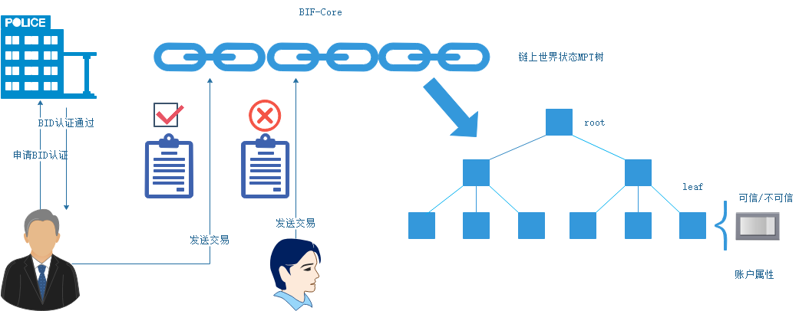
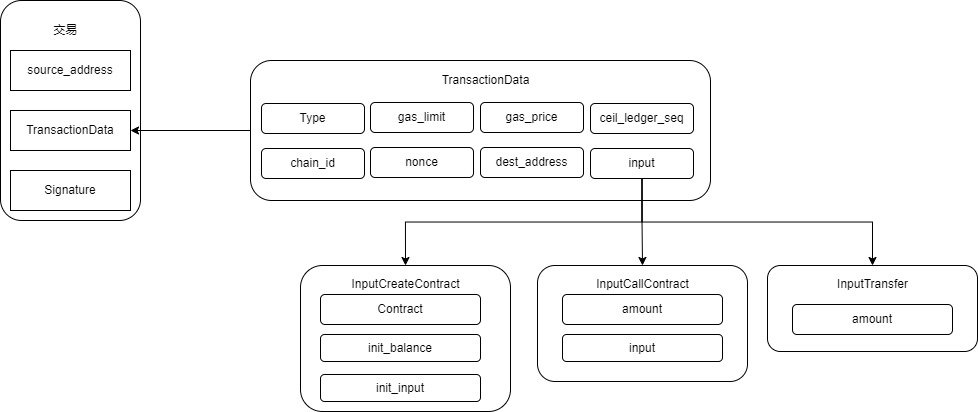
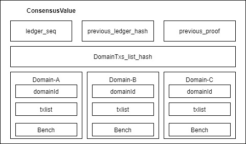
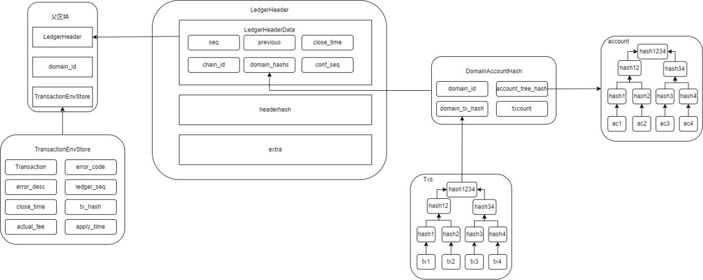

# 2.星火关键字

## 2.1 业务域

为支持不同业务领域数据在区块链上运行的业务场景，星火链增加了业务域（又叫服务域）的概念，不同业务领域数据用于构建不同业务域。

利用业务域，不同行业可以直接在星火链上处理业务数据。利用超级节点由权威机构承建背书，不同业务数据交易采用相同共识进行处理，保证系统安全性与权威性。域间交易处理、数据存储相互隔离，保证数据的安全性。

## 2.2 账户

账户是星火链的主体，是对现实社会中法人或自然人的一种映射。在星火链中分为普通账户和合约账户，普通账户由特定的法人或自然人持有，合约账户由星火链节点生成，没有公私钥信息。

### 2.2.1 结构定义

```protobuf
message Account{
    enum TRUST_FLAG {
        UNCERT        = 0;
        TRUSTED       = 1;
        UNTRUSTED     = 2;
	};

	string address = 1;
	int64 balance = 2;
	TRUST_FLAG trusted = 3;
	string public_key = 4;
	Contract contract = 5;
}
message Contract{
    enum ContractType{
        SYSTEM = 0;
        EVM = 1;
        UNKNOWN = 10;
	}
    enum STATUS_FALG {
        ENABLED        = 0;
        DISABLED       = 1;
	};
	
	ContractType type = 1;
	string code = 2;
	int64 version = 3;
	bytes metadatas_hash = 4;
	STATUS_FALG status = 5;
}
```

- `address` : 星火地址。

- `balance` : 账户余额，即账户所含星火令的数量；当账户打包并请求执行一笔交易的时候，支付的交易费用将从`balance`中扣除。如果支付的费用超过交易执行实际需要的费用，多余的部分将返回账户`balance`。

- `trusted` : 账户可信标识，目前暂未使用。

- `public_key` : 账户公钥，即生成账号的星火公钥。

- `contract` : 如果为合约账户，包含此合约结构。

  -  `type` : 合约类型，目前仅支持`solidity`合约

  -  `code` : 合约代码

  - `version` : 合约代码版本

  - `status` : 合约启用状态，目前未使用，默认为`ENABLE`

  - `metadatas_hash` : 每个合约账号都有自己的一个小型的“版本化的键值对数据库”，用来存储用户自定义的内容。每一条数据我们都称为一个`metadata`，它有3个元素键key、值value和版本号version：

    ```protobuf
    message KeyPair
    {
         string key = 1;
         string value = 2;
         int64 version = 3;
    }
    ```

      对于一个账户的每一条`metadata`：

       `K = KeyPair.key`
    
       `V = KeyPair.SerializeAsString()`
    
  
  我们将(K,V)作为一个元素，所有的这样的(K,V)元素组成的集合记为`metadatas`，那么
  
   `metadatas_hash = MerkelRootHash(metadatas)`
  
  其中`MerkelRootHash`是对这个集合进行默克尔树进行HASH运算，参见附录`Merkel Trie`。

### 2.2.2 地址

#### 2.2.2.1 星火地址格式

星火地址是基于DID协议设计的分布式标识。星火地址的组成结构如下：

`did:bid:efy85ZbAozTgwXw92rb3QEfd7ZHcByVM`

`did:bid` : 地址前缀

`ef `: 加密类型 & 编码类型

`y85ZbAozTgwXw92rb3QEfd7ZHcByVM` ：后缀，公钥经过哈希算法之后截取， 然后再进行编码后得到的字符串，不同的编码方式生成的后缀长度和格式不同。编码类型为‘t’生成的后缀字母全为小写，其他两种类型生成的字母区分大小写。

不同类型的编码方式生成的后缀长度不同，以`Base58`编码方式生成的后缀长度为22-31字节。

#### 2.2.2.2 星火公私钥

**星火私钥**

星火私钥与原生加密算法生成的私钥不同。星火私钥中包含针对私钥的具体描述以及私钥展示的具体编码类型。星火私钥包含私钥前缀、私钥加密算法类型、编码类型以及原生私钥组成。

星火地址格式私钥格式说明：

- 私钥前缀：`0x18` `0x93` ` 0x99`

- 私钥加密算法类型：n 与星火地址格式中加密类型相同；如`edd25519`为`0x65`

- 编码类型：与星火地址格式中编码类型相同；如`base58`为 `0x66`

- 原生私钥： 按照如上格式生成私钥字符串后，需要按照编码类型格式进行处理，星火私钥:

  <left>
      PriKey = Base58(0x18 0x93 0x99 0x65 0x66 0xxxxxxx)
  </left>

**星火公钥**

星火公钥中包含针对公钥的具体描述以及公钥展示的具体编码类型。星火公钥包含公钥前缀、公钥加密算法类型、编码类型以及原生公钥组成。

星火地址格式公钥格式说明：

- 公钥前缀 ：`0xb0`

- 公钥加密算法类型：与星火地址格式中加密类型相同

-  编码类型：与星火地址格式中编码类型相同

- 原生公钥:按照如上格式生成公钥字符串后，需要按照十六进制格式进行处理，星火公钥:

  <left>
  PubKey = Hex(0xb0 0x65 0x66 0xxxxxx)    
  </left>

### 2.2.3 账户许可

账户许可由TRUST_FLAG字段和DID协议中的DDO文档决定，账户加入网络获得许可的必要条件是生成DDO文档并获得实名认证，只有经过认证的用户才能参与链上活动。



### 3.2.3 可升级合约机构

星火链从账户层面上将合约内的数据和逻辑分离，实现对智能合约升级的支持。上文的Contract结构中可以看到合约的逻辑被存储在code字段内，合约内的数据称为metadata,独立存储，合约内仅保存metadata的hash用于验证。这样的结构设计允许合约在不改变地址的情况下替换code，即合约升级。

## 2.3 交易

### 2.3.1 结构定义

交易广义的定义，它是一个对账号进行一系列操作的组合。

```protobuf
message Transaction {
    string source_address = 1;
    TransactionData data = 2;
    Signature signature = 3;
}
```

- `source_address` 交易发起者地址，交易发起者仅为普通账户地址，不能为合约账户地址；这笔交易的发起账号，必须是系统中已经存在的账号。

- `transactionData` 交易的主体，指定了这笔交易内容。

- `signatures `交易的签名；交易签名格式如下，交易签名生成规则为：

  <left>
      signData = Sign(source_address + TransactionData. SerializeAsString(), privateKey)
  </left>

即利用私钥对数据进行签名，数据格式为源账户地址source_address拼接交易体序列化后的数据`TransactionData. SerializeAsString()`。

```protobuf
message Signature {
    string public_key = 1;
    oneof data{
        bytes sign_data = 2;
        string sign_data_str = 3;
    }
}
```

- `public_key` 交易签名星火私钥对应的星火公钥。

- `data` 签名完成的数据。
  - `sign_data` 签名完成的二进制数据
  - `sign_data_str`为方便展示输出的十六进制签名数据

**交易主体定义**

```protobuf
message TransactionData {
    enum Type {
         UNKNOWN = 0;
         CREATE_CONTRACT 		= 1;  //创建合约
         CALL_CONTRACT           = 2;  //调用合约或向合约中质押、转账
         TRANSFER                = 3;  //转账或创建账户
	};
	Type  type = 1;
	int64 gas_limit = 2;
	int64 gas_price =3;
	int64 ceil_ledger_seq = 4;
	int64 chain_id = 5;
	int32 domain_id = 6;
	string nonce = 7;
	string dest_address = 8;
    oneof input {
        InputCreateContract create_account = 9;
        InputCallContract call_contract = 10;
        InputTransfer transfer = 11;
    }; 
}
```

- `type` 交易类型，目前支持合约部署，合约调用，转账三种交易类型。

- `gas_limit` 交易提供的`gas`上限。

- `gas_price` 交易提供的每个`gas`的价格。

- ceil_ledger_seq交易执行的区块高度限制。详见交易`nonce`。

- `chain_id` 链ID。

- `domain_id` 服务域ID，表示当前交易要发送到某个服务域上。

- `nonce` 某个账户发起交易的唯一标识，防止重放攻击，详见交易`nonce`。

- `dest_address` 交易作用的目的地址：

  当交易类型为`CREATE_CONTRAC`T时，`dest_address`必须为空；

  当交易类型为`CALL_CONTRACT`时，`dest_address`必须为已存在的合约账户地址；

  当交易类型为`TRANSFER`时，`dest_address`可以为空；

- `input`交易的有效负载，指定了交易的内容。

### 2.3.2 nonce设计

为防止交易重放攻击（Transaction Replay Attack），交易一旦被打包进区块，则后续该交易不可再被打包。但是用户会有再次发起与前一笔交易相同业务的需求，则必然会使得新交易与前一笔交易的hash一致，为解决此问题，会给交易增加nonce值，**星火链目标是构建大规模用户使用的区块链系统，对性能及用户体验要求较高，充分考虑上述方案后，计划采用nonce 及 ceil_ledger_seq 共同作用，来防止交易重放攻击。**

| 字段名称        | 类型           | 说明                                                         |
| --------------- | -------------- | ------------------------------------------------------------ |
| nonce           | requied int64  | 8字节随机值（BIF1.0该字段为自增值）                          |
| ceil_ledger_seq | required int64 | 区块高度，交易在current_ledger_seq高度打包才有效。 current_ledger_seq 满足条件： ceil_ledger_seq - block_limit < current_ledger_seq < ceil_ledger_seq |

相比于连续递增的整数作为nonce, 星火链方案可以在易用性及区块链性能两方面找到平衡。

1. **易用性**

   a. 使用者定期同步区块链的区块高度后，无需再与节点交互，查询nonce

   b. 使用者不再需要花费精力维护nonce,可由SDK自动生成

2. **性能**

   区块链节点只需要维护有效期内的交易nonce值，即ceil_ledger_seq > current_ledger 的nonce值集合，以降低维护成本。

   经过交易唯一性判断后的历史交易集合中，存在以下这几种可能：

   1）`ceil_ledger_seq`与`nonce`为1对N，即同一`ceil_ledger_seq`对应不同的`nonce`

   2）`ceil_ledger_seq` - `blocklimit`区间外与`nonce`为N对1

   3）`ceil_ledger_seq` - `blocklimit`区间内与`nonce`为N对N

## 2.4 共识

共识算法采用Hotsuff流水线共识，稳定密集的出块。共识数据结构如下：



星火链所有的服务域统一进行共识，共识结构`ConsensusValue`中包含每个服务域的交易列表`Domain-A`、`Domain-B`等，域交易列表的基本成员包括域ID、交易列表、以及Bench,其中Bench是并行执行的基本单位，十一组不同源账户的交易。

在共识结束后，共识节点会根据共识结构生成每个服务域的区块结构。

## 2.5 区块

区块是每个服务域（分片）的账本数据结构，包含本服务域内的交易列表，以及验证交易所需要的必要数据如账户树hash、共识证明等。



区块结构由区块头、区块体、域ID三部分组成

```protobuf
message Ledger
{
	LedgerHeader header = 1;
	int32 domain_id = 2;
	repeated TransactionEnvStore transactions = 3;
}
message LedgerHeaderData
{
	int64 seq = 1;
	bytes previous_hash = 2;
	int64 close_time = 3;
	int64 version = 4;
	int64 chain_id = 5;
	repeated DomainAccountHash domain_hashs = 6;
}
message DomainAccountHash
{
	int32 domain_id = 1;
	bytes accout_tree_hash = 2;
	bytes domain_tx_hash = 3;
	int64 txcount = 4;
}
message LedgerHeader
{
	LedgerHeaderData header = 1;
	bytes headerhash = 2;
	bytes extradata = 3;
}
```

- `seq` 区块的序号，从1开始递增，每产生1个区块，序号加1，是区块的唯一标识。

- `previous_hash` 上一个区块`hash`，即`LedgerHeader.headerhash.`对于创世区块没有上一个区块，此值为空：

  <left>
      LedgerHeader.headerhash = HASH(LedgerHeader.header.SerializeAsString())
  </left>

- `close_time` 区块形成时间；

- `version` 区块的版本号。若区块生成的设计上有变更，区块版本号可以作为识别的依据，在不同的区块中采取不同的规则；

- `chain_id` 链版本号。

- `domain_hashs` 各服务域区块验证数据

  - `domain_id` 服务域id

  - `account_tree_hash` 当前区块所在服务域修改账号树的hash。 由当前区块交易执行之后，区块所修改账号组成默克尔树计算出出来的hash。对于一个账号A，其地址为address，我们定义:

    <left>
        K = address<br>
    	V = Account.SerializeAsString()
    </left>
  
	  所有的账号以(K,V)形式组成集合ACCOUNTS:
  
    <left>
        account_tree_hash = MerkelRootHash(ACCOUNTS)
    </left>

  
    参见附录 MerkelTrie
  
  - `domain_tx_hash` 当前区块所在服务域的交易hash。对于一笔交易Tx，其交易hash为:
  
    <left>
        hash = sha256(Tx.SerializeAsString())
    </left>
  
    所有交易以字符串形式组成哈希字符串:
  
    <left>
        hashStr = hash1 + hash2 + hash… <br>
        domain_tx_hash = sha256(hashStr)
    </left>
  
  - `txcount`到目前为止，当前区块中所有服务域的交易数量
  
- `headerhash` `LedgerHeader`中`header`字段序列化hash：

  <left>
      headerhash = sha256(LedgerHeader. SerializeAsString())
  </left>

- `extradata` 保留字段。